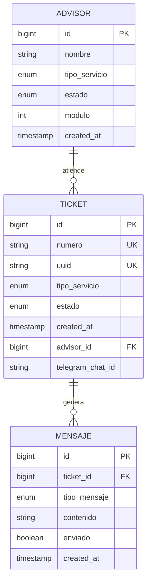

# 🏗️ Arquitectura del Sistema Ticketero

## 📋 Visión General

Sistema de gestión de tickets digitales con notificaciones en tiempo real vía Telegram, diseñado para instituciones financieras con arquitectura en capas y patrones Spring Boot.

## 🎯 Arquitectura en Capas

```
┌─────────────────────────────────────────────────────────────┐
│                    PRESENTATION LAYER                       │
│  ┌─────────────────┐  ┌─────────────────┐  ┌─────────────┐ │
│  │  REST Controllers│  │   Dashboard     │  │  Telegram   │ │
│  │   (@RestController)│  │    (HTML)      │  │   Webhook   │ │
│  └─────────────────┘  └─────────────────┘  └─────────────┘ │
└─────────────────────────────────────────────────────────────┘
                                │
┌─────────────────────────────────────────────────────────────┐
│                     BUSINESS LAYER                          │
│  ┌─────────────────┐  ┌─────────────────┐  ┌─────────────┐ │
│  │   Services      │  │   Schedulers    │  │   Mappers   │ │
│  │   (@Service)    │  │   (@Scheduled)  │  │  (Manual)   │ │
│  └─────────────────┘  └─────────────────┘  └─────────────┘ │
└─────────────────────────────────────────────────────────────┘
                                │
┌─────────────────────────────────────────────────────────────┐
│                   PERSISTENCE LAYER                         │
│  ┌─────────────────┐  ┌─────────────────┐  ┌─────────────┐ │
│  │  Repositories   │  │   JPA Entities  │  │   Flyway    │ │
│  │  (@Repository)  │  │    (@Entity)    │  │ Migrations  │ │
│  └─────────────────┘  └─────────────────┘  └─────────────┘ │
└─────────────────────────────────────────────────────────────┘
                                │
┌─────────────────────────────────────────────────────────────┐
│                     DATABASE LAYER                          │
│              PostgreSQL 16 + Índices Optimizados           │
└─────────────────────────────────────────────────────────────┘
```

## 🔄 Flujo de Datos Principal

### 1. Creación de Ticket
```
Cliente → POST /api/tickets → TicketController → TicketService 
    → TicketRepository → PostgreSQL → TelegramService → Bot API
```

### 2. Procesamiento Automático
```
@Scheduled → TicketProcessingService → AsignacionService 
    → TicketRepository → TelegramService → Notificación
```

### 3. Dashboard en Tiempo Real
```
Dashboard HTML → GET /api/admin/dashboard → AdminService 
    → Multiple Repositories → JSON Response → Frontend Update
```

## 🏛️ Patrones de Diseño Implementados

### 1. **Layered Architecture**
- **Controller**: Manejo HTTP, validación, delegación
- **Service**: Lógica de negocio, transacciones
- **Repository**: Acceso a datos, queries

### 2. **Dependency Injection**
```java
@Service
@RequiredArgsConstructor
public class TicketService {
    private final TicketRepository ticketRepository;
    private final TelegramService telegramService;
    private final AsignacionService asignacionService;
}
```

### 3. **Builder Pattern**
```java
Ticket ticket = Ticket.builder()
    .numero(generatedNumber)
    .tipoServicio(request.tipoServicio())
    .estado(TicketEstado.ESPERANDO)
    .build();
```

### 4. **Strategy Pattern**
```java
// Diferentes estrategias de asignación por tipo de servicio
public interface AsignacionStrategy {
    Optional<Advisor> asignar(TipoServicio tipo);
}
```

### 5. **Template Method**
```java
// Procesamiento común con pasos específicos
public abstract class NotificationTemplate {
    public final void sendNotification(Ticket ticket) {
        String message = buildMessage(ticket);
        validateMessage(message);
        send(message);
    }
    
    protected abstract String buildMessage(Ticket ticket);
}
```

## 🗄️ Modelo de Datos

### Entidades Principales



### Relaciones Clave
- **Ticket → Advisor**: ManyToOne (un asesor atiende múltiples tickets)
- **Ticket → Mensaje**: OneToMany (un ticket genera múltiples mensajes)
- **Advisor → TipoServicio**: Enum (especialización por servicio)

## 🔧 Componentes Técnicos

### 1. **Spring Boot Configuration**
```java
@SpringBootApplication
@EnableJpaRepositories
@EnableScheduling
@EnableJpaAuditing
public class TicketeroApplication {
    // Auto-configuration activada
}
```

### 2. **JPA/Hibernate Setup**
- **Estrategia de ID**: `GenerationType.IDENTITY`
- **Naming**: Snake_case automático
- **Lazy Loading**: Por defecto en relaciones
- **Auditoría**: `@CreatedDate`, `@LastModifiedDate`

### 3. **Telegram Integration**
```java
@Component
@RequiredArgsConstructor
public class TelegramService {
    private final RestTemplate restTemplate;
    
    @Value("${telegram.bot.token}")
    private String botToken;
    
    @Value("${telegram.bot.api-url}")
    private String apiUrl;
}
```

### 4. **Scheduled Tasks**
```java
@Component
@Slf4j
public class TicketProcessingScheduler {
    
    @Scheduled(fixedDelay = 30000) // 30 segundos
    public void procesarTicketsEnEspera() {
        // Lógica de procesamiento automático
    }
}
```

## 🚀 Decisiones Arquitectónicas

### 1. **¿Por qué Spring Boot?**
- ✅ Ecosistema maduro y estable
- ✅ Auto-configuración reduce boilerplate
- ✅ Excelente integración con JPA/Hibernate
- ✅ Actuator para monitoreo
- ✅ Testing framework integrado

### 2. **¿Por qué PostgreSQL?**
- ✅ ACID compliance para transacciones críticas
- ✅ Excelente performance con índices
- ✅ JSON support para datos flexibles
- ✅ Extensibilidad y escalabilidad
- ✅ Open source y enterprise-ready

### 3. **¿Por qué Telegram Bot API?**
- ✅ API simple y confiable
- ✅ No requiere app móvil adicional
- ✅ Push notifications nativas
- ✅ Soporte multimedia (texto, imágenes)
- ✅ Rate limiting manejable

### 4. **¿Por qué Arquitectura Síncrona?**
- ✅ Simplicidad de desarrollo y debugging
- ✅ Transacciones ACID más fáciles
- ✅ Menor complejidad operacional
- ✅ Suficiente para volumen esperado
- ⚠️ Escalabilidad limitada (mitigable con load balancing)

## 📊 Características de Performance

### 1. **Database Optimization**
```sql
-- Índices estratégicos
CREATE INDEX idx_ticket_estado_created ON ticket(estado, created_at);
CREATE INDEX idx_ticket_advisor_id ON ticket(advisor_id);
CREATE INDEX idx_advisor_tipo_estado ON advisor(tipo_servicio, estado);
```

### 2. **JPA Query Optimization**
```java
// Query derivadas (Spring genera SQL optimizado)
List<Ticket> findByEstadoOrderByCreatedAtAsc(TicketEstado estado);

// JOIN FETCH para evitar N+1
@Query("SELECT t FROM Ticket t JOIN FETCH t.advisor WHERE t.estado = :estado")
List<Ticket> findByEstadoWithAdvisor(@Param("estado") TicketEstado estado);
```

### 3. **Connection Pooling**
```yaml
spring:
  datasource:
    hikari:
      maximum-pool-size: 20
      minimum-idle: 5
      connection-timeout: 30000
      idle-timeout: 600000
```

## 🔒 Consideraciones de Seguridad

### 1. **Input Validation**
```java
public record TicketRequest(
    @NotNull @Valid TipoServicio tipoServicio,
    @Pattern(regexp = "^[0-9]{10}$") String telegramChatId
) {}
```

### 2. **SQL Injection Prevention**
- ✅ JPA Query derivadas (type-safe)
- ✅ `@Param` en queries custom
- ✅ No concatenación de strings en SQL

### 3. **Telegram Security**
- ✅ Token en variables de entorno
- ✅ Validación de chat_id format
- ✅ Rate limiting en envío de mensajes

## 🔄 Escalabilidad

### Escalabilidad Vertical (Actual)
- ✅ Optimización de queries
- ✅ Connection pooling
- ✅ JVM tuning

### Escalabilidad Horizontal (Futura)
- 🔄 Load balancer (Nginx/HAProxy)
- 🔄 Multiple instances Spring Boot
- 🔄 Database read replicas
- 🔄 Redis para caching/sessions

## 📈 Monitoreo y Observabilidad

### 1. **Spring Boot Actuator**
```yaml
management:
  endpoints:
    web:
      exposure:
        include: health,metrics,info,prometheus
  endpoint:
    health:
      show-details: always
```

### 2. **Logging Strategy**
```java
@Slf4j
public class TicketService {
    public TicketResponse create(TicketRequest request) {
        log.info("Creating ticket for service: {}", request.tipoServicio());
        // ...
        log.info("Ticket created: {} at position {}", ticket.getNumero(), position);
    }
}
```

### 3. **Custom Metrics**
```java
@Component
public class TicketMetrics {
    private final MeterRegistry meterRegistry;
    
    public void incrementTicketCreated(TipoServicio tipo) {
        Counter.builder("tickets.created")
            .tag("tipo", tipo.name())
            .register(meterRegistry)
            .increment();
    }
}
```

## 🧪 Testing Strategy

### 1. **Unit Tests**
```java
@ExtendWith(MockitoExtension.class)
class TicketServiceTest {
    @Mock private TicketRepository ticketRepository;
    @Mock private TelegramService telegramService;
    @InjectMocks private TicketService ticketService;
}
```

### 2. **Integration Tests**
```java
@SpringBootTest
@Testcontainers
class TicketIntegrationTest {
    @Container
    static PostgreSQLContainer<?> postgres = new PostgreSQLContainer<>("postgres:16");
}
```

### 3. **API Tests**
```java
@SpringBootTest(webEnvironment = SpringBootTest.WebEnvironment.RANDOM_PORT)
@AutoConfigureTestDatabase(replace = AutoConfigureTestDatabase.Replace.NONE)
class TicketControllerIntegrationTest {
    @Autowired private TestRestTemplate restTemplate;
}
```

## 🔮 Roadmap Técnico

### Fase 1 - Optimización (Actual)
- ✅ Índices de base de datos
- ✅ Query optimization
- ✅ Connection pooling

### Fase 2 - Escalabilidad
- 🔄 Redis caching
- 🔄 Load balancing
- 🔄 Database clustering

### Fase 3 - Observabilidad
- 🔄 Prometheus + Grafana
- 🔄 Distributed tracing
- 🔄 Log aggregation (ELK)

### Fase 4 - Modernización
- 🔄 Microservices (si es necesario)
- 🔄 Event-driven architecture
- 🔄 Cloud-native deployment

---

**Versión:** 1.0  
**Última actualización:** Diciembre 2024  
**Arquitecto:** Sistema Ticketero Team