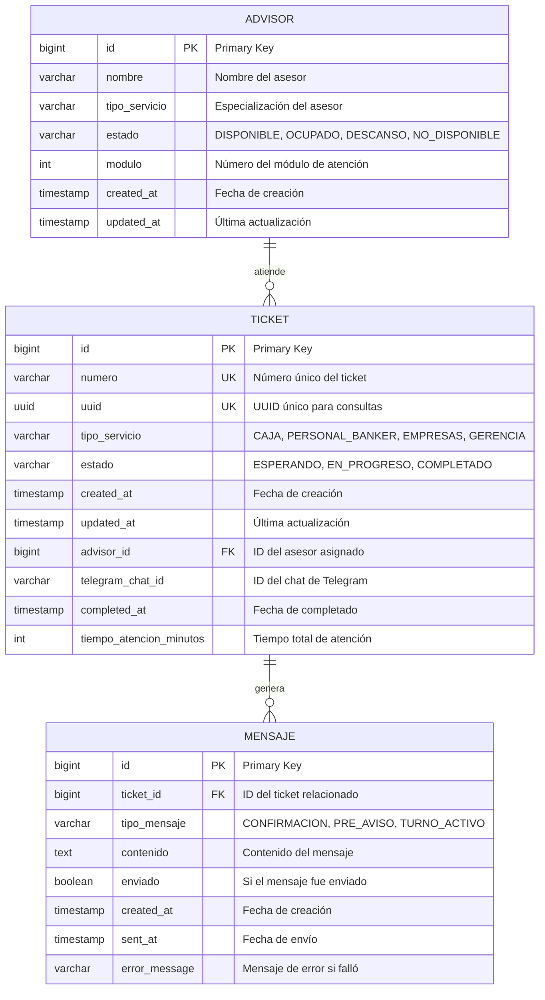

# 🗄️ Database Schema - Sistema Ticketero

## 📊 Diagrama Entidad-Relación



## 📋 Descripción de Tablas

### 1. TICKET
**Propósito:** Almacena información de todos los tickets digitales del sistema.

| Campo | Tipo | Constraints | Descripción |
|-------|------|-------------|-------------|
| `id` | BIGSERIAL | PRIMARY KEY | Identificador único autoincremental |
| `numero` | VARCHAR(20) | UNIQUE, NOT NULL | Número del ticket (ej: C071234) |
| `uuid` | UUID | UNIQUE, NOT NULL | UUID para consultas públicas |
| `tipo_servicio` | VARCHAR(20) | NOT NULL | Tipo de servicio solicitado |
| `estado` | VARCHAR(20) | NOT NULL | Estado actual del ticket |
| `created_at` | TIMESTAMP | NOT NULL, DEFAULT NOW() | Fecha de creación |
| `updated_at` | TIMESTAMP | NULL | Última actualización |
| `advisor_id` | BIGINT | FOREIGN KEY | Referencia al asesor asignado |
| `telegram_chat_id` | VARCHAR(20) | NOT NULL | ID del chat de Telegram |
| `completed_at` | TIMESTAMP | NULL | Fecha de completado |
| `tiempo_atencion_minutos` | INTEGER | NULL | Tiempo total de atención |

**Valores de Enums:**
- `tipo_servicio`: `CAJA`, `PERSONAL_BANKER`, `EMPRESAS`, `GERENCIA`
- `estado`: `ESPERANDO`, `EN_PROGRESO`, `COMPLETADO`

**Índices:**
```sql
CREATE INDEX idx_ticket_estado_created ON ticket(estado, created_at);
CREATE INDEX idx_ticket_advisor_id ON ticket(advisor_id);
CREATE INDEX idx_ticket_tipo_servicio ON ticket(tipo_servicio);
CREATE INDEX idx_ticket_telegram_chat_id ON ticket(telegram_chat_id);
CREATE UNIQUE INDEX idx_ticket_numero ON ticket(numero);
CREATE UNIQUE INDEX idx_ticket_uuid ON ticket(uuid);
```

### 2. ADVISOR
**Propósito:** Almacena información de los asesores/ejecutivos que atienden tickets.

| Campo | Tipo | Constraints | Descripción |
|-------|------|-------------|-------------|
| `id` | BIGSERIAL | PRIMARY KEY | Identificador único autoincremental |
| `nombre` | VARCHAR(100) | NOT NULL | Nombre completo del asesor |
| `tipo_servicio` | VARCHAR(20) | NOT NULL | Especialización del asesor |
| `estado` | VARCHAR(20) | NOT NULL | Estado actual del asesor |
| `modulo` | INTEGER | NOT NULL | Número del módulo de atención |
| `created_at` | TIMESTAMP | NOT NULL, DEFAULT NOW() | Fecha de creación |
| `updated_at` | TIMESTAMP | NULL | Última actualización |

**Valores de Enums:**
- `tipo_servicio`: `CAJA`, `PERSONAL_BANKER`, `EMPRESAS`, `GERENCIA`
- `estado`: `DISPONIBLE`, `OCUPADO`, `DESCANSO`, `NO_DISPONIBLE`

**Índices:**
```sql
CREATE INDEX idx_advisor_tipo_estado ON advisor(tipo_servicio, estado);
CREATE INDEX idx_advisor_estado ON advisor(estado);
CREATE INDEX idx_advisor_modulo ON advisor(modulo);
```

### 3. MENSAJE
**Propósito:** Almacena mensajes de Telegram enviados o por enviar relacionados con tickets.

| Campo | Tipo | Constraints | Descripción |
|-------|------|-------------|-------------|
| `id` | BIGSERIAL | PRIMARY KEY | Identificador único autoincremental |
| `ticket_id` | BIGINT | FOREIGN KEY, NOT NULL | Referencia al ticket |
| `tipo_mensaje` | VARCHAR(20) | NOT NULL | Tipo de mensaje |
| `contenido` | TEXT | NOT NULL | Contenido del mensaje |
| `enviado` | BOOLEAN | NOT NULL, DEFAULT FALSE | Si fue enviado exitosamente |
| `created_at` | TIMESTAMP | NOT NULL, DEFAULT NOW() | Fecha de creación |
| `sent_at` | TIMESTAMP | NULL | Fecha de envío exitoso |
| `error_message` | TEXT | NULL | Mensaje de error si falló |

**Valores de Enums:**
- `tipo_mensaje`: `CONFIRMACION`, `PRE_AVISO`, `TURNO_ACTIVO`

**Índices:**
```sql
CREATE INDEX idx_mensaje_ticket_id ON mensaje(ticket_id);
CREATE INDEX idx_mensaje_enviado ON mensaje(enviado);
CREATE INDEX idx_mensaje_tipo ON mensaje(tipo_mensaje);
CREATE INDEX idx_mensaje_created_at ON mensaje(created_at DESC);
```

## 🔗 Relaciones

### 1. TICKET → ADVISOR (Many-to-One)
```sql
ALTER TABLE ticket 
ADD CONSTRAINT fk_ticket_advisor 
FOREIGN KEY (advisor_id) REFERENCES advisor(id) 
ON DELETE SET NULL;
```

**Descripción:** Un ticket puede ser asignado a un asesor. Un asesor puede tener múltiples tickets asignados (históricamente), pero solo uno activo a la vez.

### 2. TICKET → MENSAJE (One-to-Many)
```sql
ALTER TABLE mensaje 
ADD CONSTRAINT fk_mensaje_ticket 
FOREIGN KEY (ticket_id) REFERENCES ticket(id) 
ON DELETE CASCADE;
```

**Descripción:** Un ticket puede generar múltiples mensajes (confirmación, pre-aviso, turno activo). Si se elimina un ticket, se eliminan todos sus mensajes.

## 📊 Migraciones Flyway

### V1__create_tables.sql
```sql
-- Crear tabla advisor
CREATE TABLE advisor (
    id BIGSERIAL PRIMARY KEY,
    nombre VARCHAR(100) NOT NULL,
    tipo_servicio VARCHAR(20) NOT NULL,
    estado VARCHAR(20) NOT NULL DEFAULT 'DISPONIBLE',
    modulo INTEGER NOT NULL,
    created_at TIMESTAMP NOT NULL DEFAULT NOW(),
    updated_at TIMESTAMP
);

-- Crear tabla ticket
CREATE TABLE ticket (
    id BIGSERIAL PRIMARY KEY,
    numero VARCHAR(20) UNIQUE NOT NULL,
    uuid UUID UNIQUE NOT NULL DEFAULT gen_random_uuid(),
    tipo_servicio VARCHAR(20) NOT NULL,
    estado VARCHAR(20) NOT NULL DEFAULT 'ESPERANDO',
    created_at TIMESTAMP NOT NULL DEFAULT NOW(),
    updated_at TIMESTAMP,
    advisor_id BIGINT,
    telegram_chat_id VARCHAR(20) NOT NULL,
    completed_at TIMESTAMP,
    tiempo_atencion_minutos INTEGER,
    CONSTRAINT fk_ticket_advisor FOREIGN KEY (advisor_id) 
        REFERENCES advisor(id) ON DELETE SET NULL
);

-- Crear tabla mensaje
CREATE TABLE mensaje (
    id BIGSERIAL PRIMARY KEY,
    ticket_id BIGINT NOT NULL,
    tipo_mensaje VARCHAR(20) NOT NULL,
    contenido TEXT NOT NULL,
    enviado BOOLEAN NOT NULL DEFAULT FALSE,
    created_at TIMESTAMP NOT NULL DEFAULT NOW(),
    sent_at TIMESTAMP,
    error_message TEXT,
    CONSTRAINT fk_mensaje_ticket FOREIGN KEY (ticket_id) 
        REFERENCES ticket(id) ON DELETE CASCADE
);
```

### V2__create_indexes.sql
```sql
-- Índices para tabla ticket
CREATE INDEX idx_ticket_estado_created ON ticket(estado, created_at);
CREATE INDEX idx_ticket_advisor_id ON ticket(advisor_id);
CREATE INDEX idx_ticket_tipo_servicio ON ticket(tipo_servicio);
CREATE INDEX idx_ticket_telegram_chat_id ON ticket(telegram_chat_id);

-- Índices para tabla advisor
CREATE INDEX idx_advisor_tipo_estado ON advisor(tipo_servicio, estado);
CREATE INDEX idx_advisor_estado ON advisor(estado);
CREATE INDEX idx_advisor_modulo ON advisor(modulo);

-- Índices para tabla mensaje
CREATE INDEX idx_mensaje_ticket_id ON mensaje(ticket_id);
CREATE INDEX idx_mensaje_enviado ON mensaje(enviado);
CREATE INDEX idx_mensaje_tipo ON mensaje(tipo_mensaje);
CREATE INDEX idx_mensaje_created_at ON mensaje(created_at DESC);
```

### V3__insert_sample_data.sql
```sql
-- Insertar asesores de ejemplo
INSERT INTO advisor (nombre, tipo_servicio, estado, modulo) VALUES
('María González', 'CAJA', 'DISPONIBLE', 1),
('Carlos Rodríguez', 'CAJA', 'DISPONIBLE', 2),
('Ana Martínez', 'PERSONAL_BANKER', 'DISPONIBLE', 3),
('Luis Fernández', 'PERSONAL_BANKER', 'DISPONIBLE', 4),
('Carmen López', 'EMPRESAS', 'DISPONIBLE', 5),
('Roberto Silva', 'EMPRESAS', 'DISPONIBLE', 6),
('Patricia Morales', 'GERENCIA', 'DISPONIBLE', 7),
('Miguel Torres', 'GERENCIA', 'DISPONIBLE', 8);

-- Actualizar secuencias
SELECT setval('advisor_id_seq', (SELECT MAX(id) FROM advisor));
SELECT setval('ticket_id_seq', 1);
SELECT setval('mensaje_id_seq', 1);
```

## 🔍 Queries Comunes

### 1. Obtener Tickets en Espera por Tipo
```sql
SELECT t.id, t.numero, t.tipo_servicio, t.created_at,
       ROW_NUMBER() OVER (
           PARTITION BY t.tipo_servicio 
           ORDER BY t.created_at ASC
       ) as posicion_en_cola
FROM ticket t
WHERE t.estado = 'ESPERANDO'
ORDER BY t.tipo_servicio, t.created_at;
```

### 2. Asesores Disponibles por Tipo de Servicio
```sql
SELECT a.id, a.nombre, a.modulo, a.updated_at
FROM advisor a
WHERE a.tipo_servicio = 'CAJA'
  AND a.estado = 'DISPONIBLE'
ORDER BY a.updated_at ASC
LIMIT 1;
```

### 3. Estadísticas del Dashboard
```sql
-- Tickets por estado
SELECT estado, COUNT(*) as cantidad
FROM ticket
WHERE DATE(created_at) = CURRENT_DATE
GROUP BY estado;

-- Tiempo promedio de atención por tipo
SELECT tipo_servicio, 
       AVG(tiempo_atencion_minutos) as tiempo_promedio,
       COUNT(*) as tickets_completados
FROM ticket
WHERE estado = 'COMPLETADO'
  AND DATE(created_at) = CURRENT_DATE
  AND tiempo_atencion_minutos IS NOT NULL
GROUP BY tipo_servicio;

-- Asesores por estado
SELECT estado, COUNT(*) as cantidad
FROM advisor
GROUP BY estado;
```

### 4. Tickets Asignados a Asesor
```sql
SELECT t.id, t.numero, t.tipo_servicio, t.created_at,
       EXTRACT(EPOCH FROM (NOW() - t.updated_at))/60 as minutos_en_progreso
FROM ticket t
WHERE t.advisor_id = ?
  AND t.estado = 'EN_PROGRESO'
ORDER BY t.updated_at ASC;
```

### 5. Mensajes Pendientes de Envío
```sql
SELECT m.id, m.ticket_id, m.tipo_mensaje, m.contenido,
       t.numero, t.telegram_chat_id
FROM mensaje m
JOIN ticket t ON m.ticket_id = t.id
WHERE m.enviado = FALSE
  AND m.created_at > NOW() - INTERVAL '1 hour'
ORDER BY m.created_at ASC;
```

## 📈 Optimización de Performance

### 1. Índices Estratégicos
```sql
-- Índice compuesto para consultas de cola
CREATE INDEX idx_ticket_tipo_estado_created 
ON ticket(tipo_servicio, estado, created_at);

-- Índice para búsquedas por número
CREATE UNIQUE INDEX idx_ticket_numero_lower 
ON ticket(LOWER(numero));

-- Índice para consultas de dashboard
CREATE INDEX idx_ticket_created_date 
ON ticket(DATE(created_at), estado);

-- Índice para mensajes no enviados
CREATE INDEX idx_mensaje_enviado_created 
ON mensaje(enviado, created_at) 
WHERE enviado = FALSE;
```

### 2. Particionamiento (Para Alto Volumen)
```sql
-- Particionar tabla ticket por fecha (mensual)
CREATE TABLE ticket_y2024m12 PARTITION OF ticket
FOR VALUES FROM ('2024-12-01') TO ('2025-01-01');

-- Particionar tabla mensaje por fecha (mensual)
CREATE TABLE mensaje_y2024m12 PARTITION OF mensaje
FOR VALUES FROM ('2024-12-01') TO ('2025-01-01');
```

### 3. Estadísticas y Análisis
```sql
-- Actualizar estadísticas
ANALYZE ticket;
ANALYZE advisor;
ANALYZE mensaje;

-- Ver estadísticas de índices
SELECT schemaname, tablename, indexname, idx_tup_read, idx_tup_fetch
FROM pg_stat_user_indexes
WHERE schemaname = 'public'
ORDER BY idx_tup_read DESC;

-- Queries más lentas
SELECT query, mean_time, calls, total_time
FROM pg_stat_statements
WHERE query LIKE '%ticket%'
ORDER BY mean_time DESC
LIMIT 10;
```

## 🔧 Mantenimiento

### 1. Limpieza de Datos Antiguos
```sql
-- Eliminar tickets completados hace más de 1 año
DELETE FROM ticket 
WHERE estado = 'COMPLETADO' 
  AND completed_at < NOW() - INTERVAL '1 year';

-- Eliminar mensajes enviados hace más de 6 meses
DELETE FROM mensaje 
WHERE enviado = TRUE 
  AND sent_at < NOW() - INTERVAL '6 months';

-- Limpiar mensajes con errores antiguos
DELETE FROM mensaje 
WHERE enviado = FALSE 
  AND error_message IS NOT NULL
  AND created_at < NOW() - INTERVAL '1 week';
```

### 2. Reindexación Periódica
```sql
-- Reindexar tablas principales (ejecutar en mantenimiento)
REINDEX TABLE ticket;
REINDEX TABLE advisor;
REINDEX TABLE mensaje;

-- Actualizar estadísticas
VACUUM ANALYZE ticket;
VACUUM ANALYZE advisor;
VACUUM ANALYZE mensaje;
```

### 3. Monitoreo de Espacio
```sql
-- Tamaño de tablas
SELECT 
    schemaname,
    tablename,
    pg_size_pretty(pg_total_relation_size(schemaname||'.'||tablename)) as size
FROM pg_tables 
WHERE schemaname = 'public'
ORDER BY pg_total_relation_size(schemaname||'.'||tablename) DESC;

-- Tamaño de índices
SELECT 
    schemaname,
    tablename,
    indexname,
    pg_size_pretty(pg_relation_size(indexname)) as size
FROM pg_indexes 
WHERE schemaname = 'public'
ORDER BY pg_relation_size(indexname) DESC;
```

## 🔒 Seguridad

### 1. Permisos de Usuario
```sql
-- Crear usuario de aplicación con permisos limitados
CREATE USER ticketero_app WITH PASSWORD 'secure_password';

-- Otorgar permisos específicos
GRANT CONNECT ON DATABASE ticketero TO ticketero_app;
GRANT USAGE ON SCHEMA public TO ticketero_app;
GRANT SELECT, INSERT, UPDATE, DELETE ON ticket TO ticketero_app;
GRANT SELECT, UPDATE ON advisor TO ticketero_app;
GRANT SELECT, INSERT, UPDATE ON mensaje TO ticketero_app;
GRANT USAGE ON ALL SEQUENCES IN SCHEMA public TO ticketero_app;
```

### 2. Row Level Security (Opcional)
```sql
-- Habilitar RLS en tabla ticket
ALTER TABLE ticket ENABLE ROW LEVEL SECURITY;

-- Política para que cada usuario solo vea sus tickets
CREATE POLICY ticket_isolation ON ticket
FOR ALL TO ticketero_app
USING (telegram_chat_id = current_setting('app.current_chat_id'));
```

### 3. Auditoría
```sql
-- Crear tabla de auditoría
CREATE TABLE audit_log (
    id BIGSERIAL PRIMARY KEY,
    table_name VARCHAR(50) NOT NULL,
    operation VARCHAR(10) NOT NULL,
    old_values JSONB,
    new_values JSONB,
    user_name VARCHAR(50) NOT NULL,
    timestamp TIMESTAMP NOT NULL DEFAULT NOW()
);

-- Trigger de auditoría para ticket
CREATE OR REPLACE FUNCTION audit_ticket_changes()
RETURNS TRIGGER AS $$
BEGIN
    IF TG_OP = 'UPDATE' THEN
        INSERT INTO audit_log (table_name, operation, old_values, new_values, user_name)
        VALUES ('ticket', 'UPDATE', row_to_json(OLD), row_to_json(NEW), user);
        RETURN NEW;
    ELSIF TG_OP = 'INSERT' THEN
        INSERT INTO audit_log (table_name, operation, new_values, user_name)
        VALUES ('ticket', 'INSERT', row_to_json(NEW), user);
        RETURN NEW;
    END IF;
    RETURN NULL;
END;
$$ LANGUAGE plpgsql;

CREATE TRIGGER ticket_audit_trigger
AFTER INSERT OR UPDATE ON ticket
FOR EACH ROW EXECUTE FUNCTION audit_ticket_changes();
```

## 📊 Configuración de Conexión

### application-prod.yml
```yaml
spring:
  datasource:
    url: jdbc:postgresql://localhost:5432/ticketero
    username: ticketero_app
    password: ${DB_PASSWORD}
    driver-class-name: org.postgresql.Driver
    hikari:
      maximum-pool-size: 20
      minimum-idle: 5
      connection-timeout: 30000
      idle-timeout: 600000
      max-lifetime: 1800000
      leak-detection-threshold: 60000
  
  jpa:
    hibernate:
      ddl-auto: validate
    show-sql: false
    properties:
      hibernate:
        dialect: org.hibernate.dialect.PostgreSQLDialect
        format_sql: true
        use_sql_comments: false
        jdbc:
          batch_size: 20
        order_inserts: true
        order_updates: true
```

---

**Versión:** 1.0  
**Base de Datos:** PostgreSQL 16  
**Última actualización:** Diciembre 2024  
**DBA:** Sistema Ticketero Team