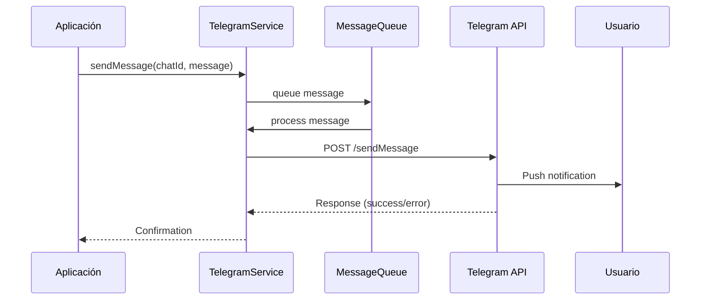

# 📱 Telegram Integration - Sistema Ticketero

## 🤖 Configuración del Bot

### 1. Crear Bot con BotFather

1. **Iniciar conversación con BotFather:**
   - Buscar `@BotFather` en Telegram
   - Enviar `/start`

2. **Crear nuevo bot:**
   ```
   /newbot
   ```

3. **Configurar nombre del bot:**
   ```
   Nombre: Sistema Ticketero
   Username: ticketero_bot (debe terminar en _bot)
   ```

4. **Obtener token:**
   ```
   BotFather responderá con:
   Use this token to access the HTTP API:
   1234567890:ABCdefGHIjklMNOpqrsTUVwxyz
   ```

5. **Configurar comandos del bot:**
   ```
   /setcommands
   
   Comandos:
   start - Iniciar conversación con el bot
   help - Mostrar ayuda
   ticket - Crear nuevo ticket
   status - Consultar estado del ticket
   ```

### 2. Configuración Avanzada

**Configurar descripción:**
```
/setdescription
Bot oficial del Sistema Ticketero para notificaciones de turnos en tiempo real.
```

**Configurar foto de perfil:**
```
/setuserpic
[Subir imagen del logo institucional]
```

**Configurar privacidad:**
```
/setprivacy
Disable - Para que el bot pueda leer todos los mensajes en grupos
```

## 🔧 Configuración Técnica

### 1. Variables de Entorno

```env
# Token del bot (OBLIGATORIO)
TELEGRAM_BOT_TOKEN=1234567890:ABCdefGHIjklMNOpqrsTUVwxyz

# URL de la API de Telegram
TELEGRAM_API_URL=https://api.telegram.org/bot

# Configuración de timeouts
TELEGRAM_CONNECT_TIMEOUT=30000
TELEGRAM_READ_TIMEOUT=60000

# Rate limiting
TELEGRAM_MAX_REQUESTS_PER_SECOND=30
TELEGRAM_MAX_REQUESTS_PER_MINUTE=1000
```

### 2. Configuración Spring Boot

**application.yml:**
```yaml
telegram:
  bot:
    token: ${TELEGRAM_BOT_TOKEN}
    api-url: ${TELEGRAM_API_URL:https://api.telegram.org/bot}
    connect-timeout: ${TELEGRAM_CONNECT_TIMEOUT:30000}
    read-timeout: ${TELEGRAM_READ_TIMEOUT:60000}
    max-requests-per-second: ${TELEGRAM_MAX_REQUESTS_PER_SECOND:30}
    max-requests-per-minute: ${TELEGRAM_MAX_REQUESTS_PER_MINUTE:1000}
  
  # Configuración de mensajes
  messages:
    confirmacion: "✅ Ticket {numero} creado\n📍 Posición: #{posicion}\n⏱️ Tiempo estimado: {tiempo} min"
    pre-aviso: "⏰ ¡Atención! Pronto será tu turno\n🎫 Ticket: {numero}\n📍 Quedan 2 personas delante"
    turno-activo: "🔔 ¡ES TU TURNO!\n🎫 Ticket: {numero}\n🏢 Diríjase al módulo {modulo}\n👨‍💼 Asesor: {asesor}"
    ticket-completado: "✅ Atención completada\n🎫 Ticket: {numero}\n⏱️ Tiempo de atención: {tiempo} min\n¡Gracias por su visita!"
```

## 🏗️ Arquitectura de Integración

### 1. Componentes Principales

```
┌─────────────────────────────────────────────────────────────┐
│                    TELEGRAM INTEGRATION                     │
│                                                             │
│  ┌─────────────────┐  ┌─────────────────┐  ┌─────────────┐ │
│  │  TelegramService│  │ MessageTemplate │  │ RateLimiter │ │
│  │                 │  │     Manager     │  │             │ │
│  └─────────────────┘  └─────────────────┘  └─────────────┘ │
│                                │                            │
│  ┌─────────────────┐  ┌─────────────────┐  ┌─────────────┐ │
│  │   RestTemplate  │  │  MessageQueue   │  │ ErrorHandler│ │
│  │                 │  │                 │  │             │ │
│  └─────────────────┘  └─────────────────┘  └─────────────┘ │
└─────────────────────────────────────────────────────────────┘
                                │
┌─────────────────────────────────────────────────────────────┐
│                    TELEGRAM BOT API                         │
│              https://api.telegram.org/bot                   │
└─────────────────────────────────────────────────────────────┘
```

### 2. Flujo de Mensajes



## 💻 Implementación del Servicio

### 1. TelegramService Principal

```java
@Service
@RequiredArgsConstructor
@Slf4j
public class TelegramService {
    
    private final RestTemplate restTemplate;
    private final MessageTemplateManager templateManager;
    private final TelegramRateLimiter rateLimiter;
    
    @Value("${telegram.bot.token}")
    private String botToken;
    
    @Value("${telegram.bot.api-url}")
    private String apiUrl;
    
    public void sendTicketConfirmation(Ticket ticket, int posicion, int tiempoEstimado) {
        String message = templateManager.buildConfirmationMessage(
            ticket.getNumero(), posicion, tiempoEstimado
        );
        
        sendMessage(ticket.getTelegramChatId(), message);
        
        // Registrar mensaje en BD
        saveMessage(ticket, TipoMensaje.CONFIRMACION, message);
    }
    
    public void sendPreAviso(Ticket ticket) {
        String message = templateManager.buildPreAvisoMessage(ticket.getNumero());
        sendMessage(ticket.getTelegramChatId(), message);
        saveMessage(ticket, TipoMensaje.PRE_AVISO, message);
    }
    
    public void sendTurnoActivo(Ticket ticket, Advisor advisor) {
        String message = templateManager.buildTurnoActivoMessage(
            ticket.getNumero(), advisor.getModulo(), advisor.getNombre()
        );
        sendMessage(ticket.getTelegramChatId(), message);
        saveMessage(ticket, TipoMensaje.TURNO_ACTIVO, message);
    }
    
    private void sendMessage(String chatId, String text) {
        try {
            // Rate limiting
            rateLimiter.acquire();
            
            String url = apiUrl + botToken + "/sendMessage";
            
            TelegramMessageRequest request = TelegramMessageRequest.builder()
                .chatId(chatId)
                .text(text)
                .parseMode("HTML")
                .disableWebPagePreview(true)
                .build();
            
            ResponseEntity<TelegramResponse> response = restTemplate.postForEntity(
                url, request, TelegramResponse.class
            );
            
            if (response.getStatusCode().is2xxSuccessful() && 
                response.getBody() != null && 
                response.getBody().isOk()) {
                
                log.info("Message sent successfully to chat: {}", chatId);
            } else {
                log.error("Failed to send message to chat: {}, response: {}", 
                    chatId, response.getBody());
                throw new TelegramException("Failed to send message");
            }
            
        } catch (Exception e) {
            log.error("Error sending Telegram message to chat: {}", chatId, e);
            throw new TelegramException("Error sending message", e);
        }
    }
    
    private void saveMessage(Ticket ticket, TipoMensaje tipo, String contenido) {
        Mensaje mensaje = Mensaje.builder()
            .ticket(ticket)
            .tipoMensaje(tipo)
            .contenido(contenido)
            .enviado(true)
            .sentAt(LocalDateTime.now())
            .build();
            
        mensajeRepository.save(mensaje);
    }
}
```

### 2. Template Manager

```java
@Component
@RequiredArgsConstructor
public class MessageTemplateManager {
    
    @Value("${telegram.messages.confirmacion}")
    private String confirmacionTemplate;
    
    @Value("${telegram.messages.pre-aviso}")
    private String preAvisoTemplate;
    
    @Value("${telegram.messages.turno-activo}")
    private String turnoActivoTemplate;
    
    @Value("${telegram.messages.ticket-completado}")
    private String completadoTemplate;
    
    public String buildConfirmationMessage(String numero, int posicion, int tiempo) {
        return confirmacionTemplate
            .replace("{numero}", numero)
            .replace("{posicion}", String.valueOf(posicion))
            .replace("{tiempo}", String.valueOf(tiempo));
    }
    
    public String buildPreAvisoMessage(String numero) {
        return preAvisoTemplate
            .replace("{numero}", numero);
    }
    
    public String buildTurnoActivoMessage(String numero, int modulo, String asesor) {
        return turnoActivoTemplate
            .replace("{numero}", numero)
            .replace("{modulo}", String.valueOf(modulo))
            .replace("{asesor}", asesor);
    }
    
    public String buildCompletadoMessage(String numero, int tiempoAtencion) {
        return completadoTemplate
            .replace("{numero}", numero)
            .replace("{tiempo}", String.valueOf(tiempoAtencion));
    }
}
```

### 3. Rate Limiter

```java
@Component
@Slf4j
public class TelegramRateLimiter {
    
    private final RateLimiter rateLimiter;
    
    @Value("${telegram.bot.max-requests-per-second:30}")
    private int maxRequestsPerSecond;
    
    public TelegramRateLimiter() {
        this.rateLimiter = RateLimiter.create(30.0); // 30 requests per second
    }
    
    @PostConstruct
    public void init() {
        rateLimiter.setRate(maxRequestsPerSecond);
        log.info("Telegram rate limiter initialized: {} requests/second", maxRequestsPerSecond);
    }
    
    public void acquire() {
        rateLimiter.acquire();
    }
    
    public boolean tryAcquire(Duration timeout) {
        return rateLimiter.tryAcquire(timeout);
    }
}
```

## 📨 DTOs y Modelos

### 1. Request DTOs

```java
@Builder
public record TelegramMessageRequest(
    @JsonProperty("chat_id")
    String chatId,
    
    String text,
    
    @JsonProperty("parse_mode")
    String parseMode,
    
    @JsonProperty("disable_web_page_preview")
    Boolean disableWebPagePreview,
    
    @JsonProperty("disable_notification")
    Boolean disableNotification,
    
    @JsonProperty("reply_markup")
    Object replyMarkup
) {}

@Builder
public record TelegramInlineKeyboard(
    @JsonProperty("inline_keyboard")
    List<List<TelegramInlineButton>> inlineKeyboard
) {}

@Builder
public record TelegramInlineButton(
    String text,
    
    @JsonProperty("callback_data")
    String callbackData,
    
    String url
) {}
```

### 2. Response DTOs

```java
public record TelegramResponse(
    boolean ok,
    String description,
    TelegramMessage result,
    Integer errorCode
) {}

public record TelegramMessage(
    @JsonProperty("message_id")
    Long messageId,
    
    TelegramUser from,
    TelegramChat chat,
    Long date,
    String text
) {}

public record TelegramUser(
    Long id,
    @JsonProperty("is_bot")
    Boolean isBot,
    @JsonProperty("first_name")
    String firstName,
    @JsonProperty("last_name")
    String lastName,
    String username
) {}

public record TelegramChat(
    Long id,
    String type,
    @JsonProperty("first_name")
    String firstName,
    @JsonProperty("last_name")
    String lastName,
    String username
) {}
```

## 🎨 Plantillas de Mensajes

### 1. Mensaje de Confirmación
```
✅ <b>Ticket {numero} creado</b>

📍 <b>Posición en cola:</b> #{posicion}
⏱️ <b>Tiempo estimado:</b> {tiempo} minutos
🏢 <b>Servicio:</b> {tipoServicio}

📱 Recibirás notificaciones cuando sea tu turno.
💡 Puedes consultar tu posición en cualquier momento.
```

### 2. Mensaje de Pre-aviso
```
⏰ <b>¡Atención!</b>

🎫 <b>Ticket:</b> {numero}
📍 <b>Estado:</b> Pronto será tu turno
👥 <b>Quedan:</b> 2 personas delante

🚶‍♂️ Prepárate para dirigirte al módulo de atención.
```

### 3. Mensaje de Turno Activo
```
🔔 <b>¡ES TU TURNO!</b>

🎫 <b>Ticket:</b> {numero}
🏢 <b>Diríjase al módulo:</b> {modulo}
👨‍💼 <b>Asesor:</b> {asesor}

⚡ Por favor, preséntese inmediatamente.
```

### 4. Mensaje de Completado
```
✅ <b>Atención completada</b>

🎫 <b>Ticket:</b> {numero}
⏱️ <b>Tiempo de atención:</b> {tiempo} minutos
⭐ <b>Estado:</b> Finalizado

🙏 ¡Gracias por su visita!
💬 Su opinión es importante para nosotros.
```

## 🔧 Configuración Avanzada

### 1. Webhook vs Polling

**Polling (Actual - Recomendado para desarrollo):**
```java
@Component
@Slf4j
public class TelegramPollingService {
    
    @Scheduled(fixedDelay = 5000) // Cada 5 segundos
    public void pollUpdates() {
        try {
            String url = apiUrl + botToken + "/getUpdates";
            // Procesar updates
        } catch (Exception e) {
            log.error("Error polling Telegram updates", e);
        }
    }
}
```

**Webhook (Recomendado para producción):**
```java
@RestController
@RequestMapping("/telegram")
@RequiredArgsConstructor
@Slf4j
public class TelegramWebhookController {
    
    private final TelegramUpdateProcessor updateProcessor;
    
    @PostMapping("/webhook")
    public ResponseEntity<Void> handleWebhook(@RequestBody TelegramUpdate update) {
        try {
            updateProcessor.process(update);
            return ResponseEntity.ok().build();
        } catch (Exception e) {
            log.error("Error processing Telegram update", e);
            return ResponseEntity.status(500).build();
        }
    }
}
```

### 2. Configurar Webhook

```bash
# Configurar webhook en producción
curl -X POST "https://api.telegram.org/bot${TELEGRAM_BOT_TOKEN}/setWebhook" \
  -H "Content-Type: application/json" \
  -d '{
    "url": "https://your-domain.com/telegram/webhook",
    "allowed_updates": ["message", "callback_query"]
  }'

# Verificar webhook
curl "https://api.telegram.org/bot${TELEGRAM_BOT_TOKEN}/getWebhookInfo"

# Eliminar webhook (volver a polling)
curl -X POST "https://api.telegram.org/bot${TELEGRAM_BOT_TOKEN}/deleteWebhook"
```

## 🛡️ Manejo de Errores

### 1. Excepciones Personalizadas

```java
public class TelegramException extends RuntimeException {
    public TelegramException(String message) {
        super(message);
    }
    
    public TelegramException(String message, Throwable cause) {
        super(message, cause);
    }
}

public class TelegramRateLimitException extends TelegramException {
    private final int retryAfter;
    
    public TelegramRateLimitException(int retryAfter) {
        super("Rate limit exceeded, retry after: " + retryAfter + " seconds");
        this.retryAfter = retryAfter;
    }
    
    public int getRetryAfter() {
        return retryAfter;
    }
}
```

### 2. Retry Logic

```java
@Component
@RequiredArgsConstructor
@Slf4j
public class TelegramRetryService {
    
    private final TelegramService telegramService;
    
    @Retryable(
        value = {TelegramException.class},
        maxAttempts = 3,
        backoff = @Backoff(delay = 1000, multiplier = 2)
    )
    public void sendMessageWithRetry(String chatId, String message) {
        telegramService.sendMessage(chatId, message);
    }
    
    @Recover
    public void recover(TelegramException ex, String chatId, String message) {
        log.error("Failed to send message after retries to chat: {}, message: {}", 
            chatId, message, ex);
        
        // Guardar mensaje fallido para reintento posterior
        saveFallidoMessage(chatId, message, ex.getMessage());
    }
    
    private void saveFallidoMessage(String chatId, String message, String error) {
        // Implementar lógica para guardar mensajes fallidos
    }
}
```

### 3. Circuit Breaker

```java
@Component
@RequiredArgsConstructor
public class TelegramCircuitBreakerService {
    
    private final CircuitBreaker circuitBreaker;
    private final TelegramService telegramService;
    
    @PostConstruct
    public void init() {
        this.circuitBreaker = CircuitBreaker.ofDefaults("telegram");
        circuitBreaker.getEventPublisher()
            .onStateTransition(event -> 
                log.info("Telegram circuit breaker state transition: {}", event));
    }
    
    public void sendMessage(String chatId, String message) {
        Supplier<Void> decoratedSupplier = CircuitBreaker
            .decorateSupplier(circuitBreaker, () -> {
                telegramService.sendMessage(chatId, message);
                return null;
            });
            
        Try.ofSupplier(decoratedSupplier)
            .recover(throwable -> {
                log.error("Circuit breaker is open, message not sent to: {}", chatId);
                return null;
            });
    }
}
```

## 📊 Monitoreo y Métricas

### 1. Métricas Personalizadas

```java
@Component
@RequiredArgsConstructor
public class TelegramMetrics {
    
    private final MeterRegistry meterRegistry;
    private final Counter messagesSent;
    private final Counter messagesFailed;
    private final Timer messageLatency;
    
    @PostConstruct
    public void init() {
        this.messagesSent = Counter.builder("telegram.messages.sent")
            .description("Total messages sent to Telegram")
            .register(meterRegistry);
            
        this.messagesFailed = Counter.builder("telegram.messages.failed")
            .description("Total failed messages to Telegram")
            .register(meterRegistry);
            
        this.messageLatency = Timer.builder("telegram.message.latency")
            .description("Message sending latency")
            .register(meterRegistry);
    }
    
    public void incrementMessagesSent(String messageType) {
        messagesSent.increment(Tags.of("type", messageType));
    }
    
    public void incrementMessagesFailed(String messageType, String error) {
        messagesFailed.increment(Tags.of("type", messageType, "error", error));
    }
    
    public Timer.Sample startTimer() {
        return Timer.start(meterRegistry);
    }
    
    public void recordLatency(Timer.Sample sample, String messageType) {
        sample.stop(Timer.builder("telegram.message.latency")
            .tag("type", messageType)
            .register(meterRegistry));
    }
}
```

### 2. Health Check

```java
@Component
public class TelegramHealthIndicator implements HealthIndicator {
    
    private final TelegramService telegramService;
    
    @Override
    public Health health() {
        try {
            // Test de conectividad con Telegram API
            boolean isHealthy = telegramService.testConnection();
            
            if (isHealthy) {
                return Health.up()
                    .withDetail("telegram", "Connected")
                    .withDetail("api", "https://api.telegram.org")
                    .build();
            } else {
                return Health.down()
                    .withDetail("telegram", "Connection failed")
                    .build();
            }
        } catch (Exception e) {
            return Health.down()
                .withDetail("telegram", "Error: " + e.getMessage())
                .build();
        }
    }
}
```

## 🧪 Testing

### 1. Unit Tests

```java
@ExtendWith(MockitoExtension.class)
class TelegramServiceTest {
    
    @Mock
    private RestTemplate restTemplate;
    
    @Mock
    private MessageTemplateManager templateManager;
    
    @Mock
    private TelegramRateLimiter rateLimiter;
    
    @InjectMocks
    private TelegramService telegramService;
    
    @Test
    void shouldSendTicketConfirmation() {
        // Given
        Ticket ticket = createTestTicket();
        String expectedMessage = "✅ Ticket C001 creado...";
        
        when(templateManager.buildConfirmationMessage(any(), anyInt(), anyInt()))
            .thenReturn(expectedMessage);
        
        when(restTemplate.postForEntity(any(), any(), eq(TelegramResponse.class)))
            .thenReturn(ResponseEntity.ok(createSuccessResponse()));
        
        // When
        telegramService.sendTicketConfirmation(ticket, 1, 5);
        
        // Then
        verify(rateLimiter).acquire();
        verify(restTemplate).postForEntity(any(), any(), eq(TelegramResponse.class));
    }
}
```

### 2. Integration Tests

```java
@SpringBootTest
@TestPropertySource(properties = {
    "telegram.bot.token=test_token",
    "telegram.bot.api-url=http://localhost:8089/bot"
})
class TelegramIntegrationTest {
    
    @Autowired
    private TelegramService telegramService;
    
    @RegisterExtension
    static WireMockExtension wireMock = WireMockExtension.newInstance()
        .options(wireMockConfig().port(8089))
        .build();
    
    @Test
    void shouldSendMessageSuccessfully() {
        // Given
        wireMock.stubFor(post(urlPathMatching("/bot.*/sendMessage"))
            .willReturn(aResponse()
                .withStatus(200)
                .withHeader("Content-Type", "application/json")
                .withBody("{\"ok\": true, \"result\": {\"message_id\": 123}}")));
        
        Ticket ticket = createTestTicket();
        
        // When & Then
        assertDoesNotThrow(() -> 
            telegramService.sendTicketConfirmation(ticket, 1, 5));
    }
}
```

## 🔍 Troubleshooting

### Problemas Comunes

**1. Token inválido:**
```bash
# Verificar token
curl "https://api.telegram.org/bot${TELEGRAM_BOT_TOKEN}/getMe"

# Respuesta esperada:
{"ok":true,"result":{"id":123456789,"is_bot":true,"first_name":"TicketeroBot"}}
```

**2. Chat ID inválido:**
```bash
# El chat ID debe ser numérico y válido
# Obtener chat ID: usuario debe enviar /start al bot primero
```

**3. Rate limiting:**
```
Error 429: Too Many Requests
Retry-After: 30

# Implementar backoff exponencial
# Reducir frecuencia de envío
```

**4. Mensaje muy largo:**
```
Error 400: Message is too long
# Telegram límite: 4096 caracteres
# Dividir mensajes largos
```

### Logs Útiles

```bash
# Ver logs de Telegram
docker-compose logs api | grep -i telegram

# Monitorear rate limiting
docker-compose logs api | grep -i "rate limit"

# Ver errores de envío
docker-compose logs api | grep -i "failed to send"
```

---

**Versión:** 1.0  
**Telegram Bot API:** 6.0+  
**Última actualización:** Diciembre 2024  
**Integration Team:** Sistema Ticketero